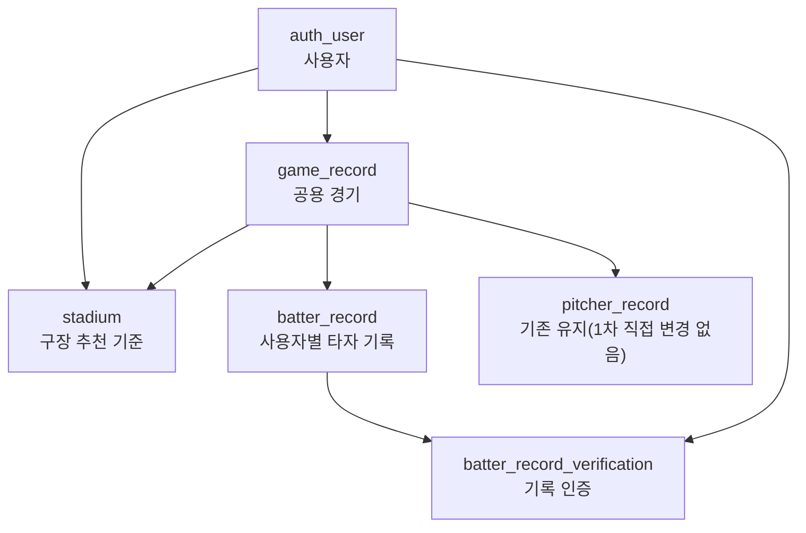
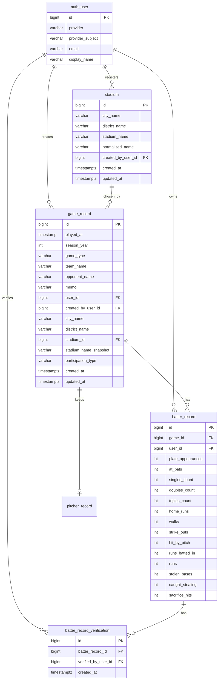

# My Baseball Record v2 Current ERD

## 1. 문서 목적

이 문서는 MBR v2의 경기 생성/참여/인증 구조를 받치기 위한 현재 DB 방향을 정리한다.

핵심 질문은 다음과 같다.

- 기존 `game_record`, `batter_record`를 어떻게 계속 사용할 것인가
- 새 공용 경기 개념을 어떤 컬럼과 관계로 표현할 것인가
- 기존 사용자 기록을 깨지 않고 어떻게 점진 전환할 것인가

## 2. 설계 원칙

- `docs/milestone-1/2026-03-31-current-erd.md`는 v1 기준 문서로 그대로 보관한다.
- v2는 기존 테이블을 버리지 않고 확장한다.
- 기존 사용자의 홈/통계/최근 경기 데이터는 계속 보여야 한다.
- 1차 범위는 타자 기록 중심이다.
- `pitcher_record`는 이번 전환에서 직접 변경하지 않는다.

## 3. 현재 v1 구조의 한계

v1에서 `game_record`는 사실상 `개인 기록 상위 엔티티`처럼 쓰인다.

현재 관계:

- `game_record` 1개
- `batter_record` 1개
- `pitcher_record` 1개

즉 한 경기 행 아래 여러 사용자의 타자 기록을 두는 구조가 아니다.

이 한계 때문에 아래가 어렵다.

- 같은 경기에서 여러 사용자가 기록 남기기
- 경기 정보 화면에서 사용자별 기록 같이 보기
- 같은 경기 기반 기록 인증

## 4. v2 핵심 방향

v2에서는 `game_record`를 `공용 경기`로 확장한다.

즉:

- `game_record` = 여러 사용자가 공유하는 경기
- `batter_record` = 그 경기 안에서 한 사용자의 타자 기록

예:

- `2026-05-20 10:30 / 부산시 강서구 / 맥도A` 경기 1개 = `game_record`
- 그 경기에서
  - 조상우 `batter_record`
  - 김영훈 `batter_record`
  - 서세홍 `batter_record`

## 5. v2 ERD 한눈에 보기

## 6. 핵심 테이블

### `auth_user`

기존 사용자 테이블을 그대로 사용한다.

이번 v2 전환에서는 아래 FK 연결의 기준이 된다.

- `game_record.created_by_user_id`
- `stadium.created_by_user_id`
- `batter_record.user_id`
- `batter_record_verification.verified_by_user_id`

### `game_record`

v2에서 `공용 경기` 상위 엔티티로 확장한다.

기존 주요 컬럼:

- `id`
- `played_at`
- `season_year`
- `game_type`
- `team_name`
- `opponent_name`
- `memo`
- `user_id`
- `participation_type`
- `created_at`
- `updated_at`

v2 추가 컬럼:

- `created_by_user_id`
- `city_name`
- `district_name`
- `stadium_id`
- `stadium_name_snapshot`

의미:

- `user_id`는 기존 데이터 호환을 위해 유지한다.
- `created_by_user_id`는 v2에서 누가 이 경기를 만들었는지 명확히 표현한다.
- `city_name`, `district_name`은 후보 탐색과 경기 정보 표시에 사용한다.
- `stadium_id`는 추천 목록에서 선택된 표준 구장을 연결한다.
- `stadium_name_snapshot`은 당시 사용자에게 보인 구장명을 안정적으로 보존한다.

주의:

- 1차에서는 기존 `user_id`를 즉시 제거하거나 의미를 강제로 바꾸지 않는다.
- 기존 데이터는 `created_by_user_id = user_id`로 백필한다.

### `batter_record`

v2에서 `사용자별 타자 기록` 엔티티로 확장한다.

기존 주요 컬럼:

- `id`
- `game_id`
- `plate_appearances`
- `at_bats`
- `singles_count`
- `doubles_count`
- `triples_count`
- `home_runs`
- `walks`
- `strike_outs`
- `hit_by_pitch`
- `runs_batted_in`
- `runs`
- `stolen_bases`
- `caught_stealing`
- `sacrifice_hits`

v2 추가/변경:

- `user_id` 추가
- 기존 `game_id UNIQUE` 제거
- 대신 `(game_id, user_id)` unique 추가

의미:

- 한 경기에는 여러 사용자의 `batter_record`가 달릴 수 있다.
- 한 사용자는 한 경기에서 타자 기록 1개만 남길 수 있다.

기존 데이터 처리:

- 기존 `batter_record.user_id`는 `game_record.user_id`로 백필한다.

### `stadium`

구장 추천/직접 입력/유사 이름 비교용 테이블이다.

주요 컬럼:

- `id`
- `city_name`
- `district_name`
- `stadium_name`
- `normalized_name`
- `created_by_user_id`
- `created_at`
- `updated_at`

의미:

- `stadium_name`은 사용자에게 실제로 보여지는 이름이다.
- `normalized_name`은 `삼락A`, `삼락 A`, `삼락구장A` 같은 차이를 줄이기 위한 비교용 값이다.

### `batter_record_verification`

기록 인증용 테이블이다.

주요 컬럼:

- `id`
- `batter_record_id`
- `verified_by_user_id`
- `created_at`

제약:

- `(batter_record_id, verified_by_user_id)` unique

의미:

- 여러 명이 같은 기록을 인증하는 것은 가능하다.
- 같은 사람은 같은 기록을 두 번 인증할 수 없다.
- 1명 이상 인증이 있으면 화면에서는 `인증 기록`으로 본다.

### `pitcher_record`

현재 테이블을 유지한다.

1차 정책:

- 이번 migration에서는 직접 변경하지 않는다.
- v2 첫 구현도 투수 기록은 다루지 않는다.
- 이후 투수 v2를 열 때 `batter_record`와 같은 패턴으로 다시 검토한다.

## 7. v2 관계

## 8. 참여자와 생성자 해석

### 생성자

- `game_record.created_by_user_id`
- 누가 이 경기를 먼저 만들었는지 보여주고, 인증 권한 기준에도 사용한다.

### 참여자

1차에서는 별도 참여자 테이블을 두지 않는다.

기준:

- 해당 `game_record`에 연결된 `batter_record`가 있으면 참여자로 본다.

즉:

- 경기만 만들고 기록을 남기지 않으면 최종 참여자로 보지 않는다.
- 기록 입력 완료 여부가 참여 기준이다.

## 9. 홈/통계 호환 원칙

가장 중요한 호환 원칙은 기존 사용자의 홈/통계가 깨지지 않는 것이다.

방향:

- 기존 `game_record`, `batter_record`는 그대로 유지한다.
- `batter_record.user_id` 백필 후에는 집계 기준을 점진적으로 `batter_record.user_id` 중심으로 옮긴다.

이유:

- v1에서는 `game_record.user_id`가 기록 주인 역할이었다.
- v2에서는 `game_record`가 공용 경기로 확장되므로, 최종적으로는 `batter_record.user_id`가 실제 기록 소유자 기준이 된다.

## 10. Migration 순서

1. `stadium` 테이블 생성
2. `game_record`에 v2용 컬럼 추가
3. `batter_record.user_id` 추가
4. 기존 `batter_record.user_id` 백필
5. 기존 `batter_record.game_id` 단독 unique 제거
6. `(game_id, user_id)` unique 추가
7. `batter_record_verification` 생성
8. `game_record.created_by_user_id = user_id` 백필

## 11. 현재 결정에서 보류한 것

- 투수 기록의 다인 경기 구조
- 참여 예정자/관전자 같은 별도 참여 상태
- 인증 수 노출
- 운영자가 구장 중복을 수동 정리하는 기능
- 전국 행정구역 공식 데이터 연동 방식

## 12. 다음 단계

- Flyway migration 구현
- 백엔드 조회/저장 로직을 `batter_record.user_id` 기준으로 점진 전환
- 경기 후보 조회, 경기 생성, 경기 상세, 기록 인증 API 설계
