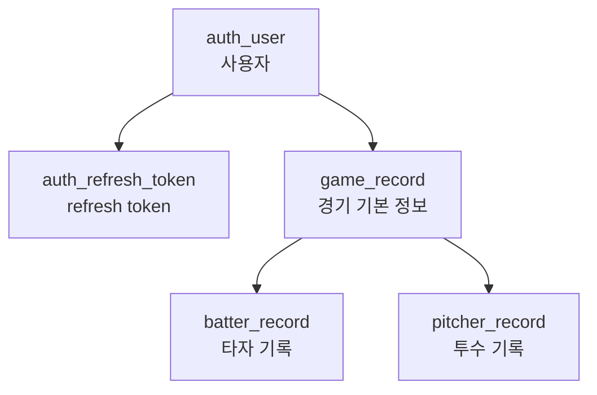
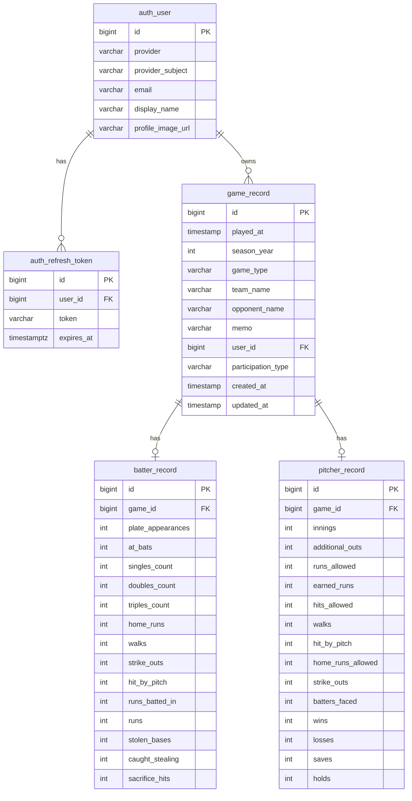

# 현재 ERD 정리

## 목적

이 문서는 2026-03-31 기준 현재 서비스가 실제로 사용하는 데이터베이스 구조를 빠르게 이해하기 위한 문서다.
지금 버전은 인증, 경기 기본 정보, 타자 기록 저장까지를 중심으로 본다.

## ERD 한눈에 보기

## 핵심 테이블

### `auth_user`

사용자 기본 정보 테이블이다.

주요 컬럼:

- `id`: PK
- `provider`: 로그인 공급자. 현재 `KAKAO` 중심
- `provider_subject`: 공급자 내부 사용자 식별자
- `email`: nullable
- `display_name`: 사용자 표시 이름
- `profile_image_url`: 프로필 이미지 URL

제약:

- `(provider, provider_subject)` 유니크

의미:

- 같은 공급자에서 같은 사용자는 한 번만 생성된다.

### `auth_refresh_token`

refresh token 저장 테이블이다.

주요 컬럼:

- `id`: PK
- `user_id`: `auth_user.id` FK
- `token`: refresh token 문자열
- `expires_at`: 만료 시각

제약:

- `token` 유니크
- `user_id -> auth_user.id` FK

의미:

- cookie에 담기는 refresh token의 서버 저장소다.
- rotation, revoke, logout 처리를 이 테이블 기준으로 한다.

### `game_record`

경기 기본 정보 테이블이다.

주요 컬럼:

- `id`: PK
- `played_at`: 경기 시각
- `season_year`: 시즌 연도
- `game_type`: 경기 유형
- `team_name`: 우리 팀 이름
- `opponent_name`: 상대 팀 이름
- `memo`: 메모
- `user_id`: `auth_user.id` FK
- `participation_type`: 타자/투수/겸업 참여 유형
- `created_at`
- `updated_at`

의미:

- 경기 자체의 기본 행이다.
- 현재 milestone-1에서는 최소 입력만 받고 있지만, 이후 팀명/메모/참여 유형 확장 여지를 남겨둔 구조다.

### `batter_record`

타자 기록 테이블이다.

주요 컬럼:

- `id`: PK
- `game_id`: `game_record.id` FK, unique
- `plate_appearances`
- `at_bats`
- `singles_count`
- `doubles_count`
- `triples_count`
- `home_runs`
- `walks`
- `strike_outs`
- `hit_by_pitch`
- `runs_batted_in`
- `runs`
- `stolen_bases`
- `caught_stealing`
- `sacrifice_hits`

제약:

- `game_id` unique

의미:

- 현재 milestone-1 경기 생성은 `game_record` 1행 + `batter_record` 1행 저장으로 본다.
- 현재 프론트 입력은 일부 필드만 받지만, 나머지 필드는 이후 확장용으로 남아 있다.

### `pitcher_record`

투수 기록 테이블이다.

주요 컬럼:

- `id`: PK
- `game_id`: `game_record.id` FK, unique
- 이닝/실점/자책/피안타/볼넷/사구/탈삼진 등 투수 지표

의미:

- 현재 milestone-1 주 흐름에서는 아직 적극적으로 사용하지 않는다.
- 이후 투수 기록 입력/조회 확장을 위해 미리 존재한다.

## 관계

## 현재 실제 사용 흐름

### 로그인

- 카카오 로그인 성공
- `auth_user` 생성 또는 재사용
- `auth_refresh_token` 생성

### 경기 생성

- `POST /api/games`
- `game_record` 생성
- `batter_record` 생성

### 홈 조회

- `GET /api/stats?scope=season|career`
- `GET /api/games/recent?limit=3`

현재 홈은 `game_record + batter_record` 집계 결과를 사용한다.

## 현재 스키마에서 기억할 점

- `played_at`은 현재 `TIMESTAMP`다.
- `auth_user`는 더 이상 Google 전용 구조가 아니라 provider 공통 구조다.
- 타자 기록 입력 UI는 일부 필드만 받지만, DB는 더 많은 컬럼을 이미 가지고 있다.
- 중복 경기 방지는 아직 서버에서 강제하지 않는다. 이후 `user_id + played_at` 정책을 별도로 정해야 한다.

## TODO

- `auth_refresh_token.expires_at`은 `TIMESTAMPTZ`인데, `game_record.created_at`, `game_record.updated_at`은 현재 `TIMESTAMP`다.
- `created_at`, `updated_at`은 절대 시점을 저장하는 성격이므로 `TIMESTAMPTZ`로 통일하는 방향을 검토한다.
- `played_at`은 "사용자가 입력한 경기 로컬 시각"으로 볼지, "절대 시점"으로 볼지 도메인 의미를 먼저 확정한 뒤 `TIMESTAMP` 유지 또는 `TIMESTAMPTZ` 전환을 결정한다.
- `auth_user`에는 현재 시각 컬럼이 없다. 운영/추적 관점에서 아래 컬럼 추가를 검토한다.
  - `created_at`: 최초 가입 시각
  - `updated_at`: 프로필 동기화/갱신 시각
  - `last_login_at`: 마지막 로그인 성공 시각
