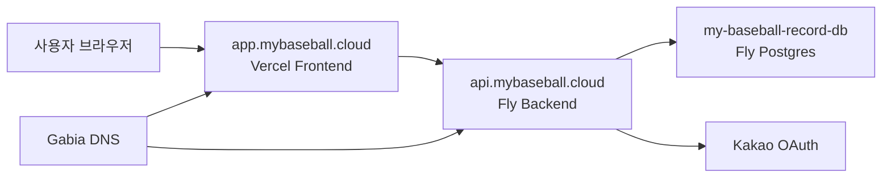
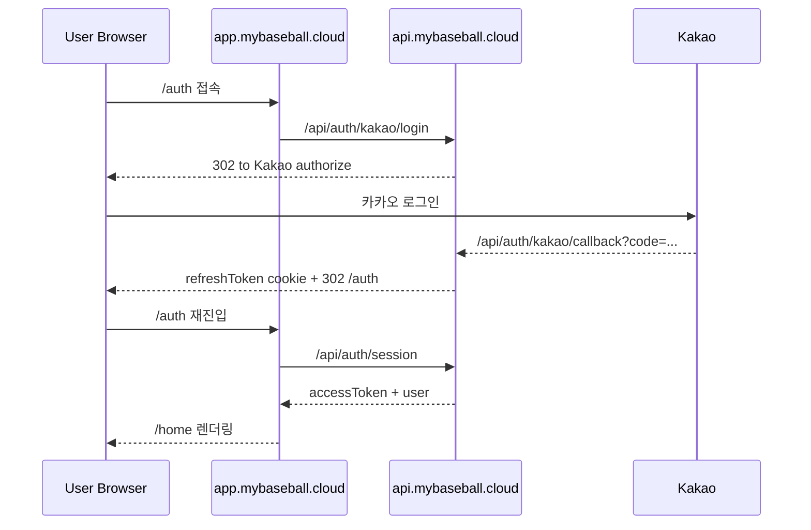

# 도메인 및 배포 구조

## 목적

이 문서는 현재 서비스가 어떤 도메인과 배포 인프라 위에서 동작하는지 정리한다.
특히 프론트, 백엔드, 카카오 로그인, DNS, cookie가 어떻게 연결되는지 빠르게 파악하기 위한 문서다.

검증 기준:

- 기준 브랜치: `main`
- 외부 응답 확인 시점: `2026-05-12`

## 도메인 설계도

## 로그인 흐름 설계도

## 현재 도메인 구조

- 프론트: `https://app.mybaseball.cloud`
- 백엔드: `https://api.mybaseball.cloud`

보조/이전 도메인:

- 프론트 기본 Vercel 도메인: `https://my-baseball-record.vercel.app`
- 백엔드 기본 Fly 도메인: `https://my-baseball-record.fly.dev`
- 이전 임시 도메인: `app.plannr.cloud`, `api.plannr.cloud`

## 왜 프론트와 백엔드를 서브도메인으로 나눴는가

- 프론트와 백엔드가 같은 상위 도메인(`mybaseball.cloud`) 아래에 있으면 cookie 처리와 브라우저 정책 대응이 더 안정적이다.
- 특히 카카오 로그인 후 refresh token cookie를 다루는 구조에서 Safari/시크릿 창 이슈를 줄이는 데 도움이 된다.

## 배포 인프라

### 프론트

- 플랫폼: Vercel
- 서비스 주소: `app.mybaseball.cloud`

역할:

- Next.js 프론트 앱 제공
- `/auth`, `/home`, `/games/new` 등 UI 렌더링

### 백엔드

- 플랫폼: Fly.io
- 서비스 주소: `api.mybaseball.cloud`

역할:

- 인증 API
- 경기 생성/조회 API
- 통계/최근 경기 API

### 데이터베이스

- 플랫폼: Fly Postgres
- 앱 이름: `my-baseball-record-db`

역할:

- `auth_user`
- `auth_refresh_token`
- `game_record`
- `batter_record`
- `pitcher_record`
저장

## DNS 역할 분리

### Gabia

- 도메인 구매/보유
- DNS 레코드 관리

### Vercel

- `app.mybaseball.cloud` 연결
- 보통 `CNAME app -> <vercel-dns-target>` 형태

### Fly

- `api.mybaseball.cloud` 연결
- `fly certs add api.mybaseball.cloud`
- 인증서 발급 및 API 라우팅

## 카카오 로그인 연결 구조

카카오 로그인 시작:

- 브라우저가 `https://api.mybaseball.cloud/api/auth/kakao/login` 호출
- 백엔드가 카카오 authorize URL로 `302`

카카오 callback:

- 카카오가 `https://api.mybaseball.cloud/api/auth/kakao/callback`으로 code 전달
- 백엔드가 카카오 code를 토큰으로 교환
- 자체 refresh token cookie 발급
- `https://app.mybaseball.cloud/auth`로 다시 `302`

## 현재 핵심 환경변수

### Vercel

- `NEXT_PUBLIC_API_BASE_URL=https://api.mybaseball.cloud`

### Fly

- `KAKAO_REDIRECT_URI=https://api.mybaseball.cloud/api/auth/kakao/callback`
- `KAKAO_FRONTEND_REDIRECT_URI=https://app.mybaseball.cloud/auth`
- `AUTH_COOKIE_DOMAIN=.mybaseball.cloud`
- `AUTH_COOKIE_SECURE=true`
- `AUTH_COOKIE_SAME_SITE=None`

## cookie 구조

- refresh token: cookie
- access token: 응답 바디로 내려오고 프론트 메모리에서 사용

의도:

- refresh token은 브라우저가 cookie로 관리
- access token은 API 호출마다 `Authorization: Bearer ...`로 사용

## 새 도메인으로 다시 바꿀 때 수정 포인트

- Gabia DNS
- Vercel custom domain
- Fly custom domain / cert
- Vercel env `NEXT_PUBLIC_API_BASE_URL`
- Fly secrets
  - `KAKAO_REDIRECT_URI`
  - `KAKAO_FRONTEND_REDIRECT_URI`
  - `AUTH_COOKIE_DOMAIN`
- backend CORS 허용 origin
- 카카오 디벨로퍼스 redirect URI
