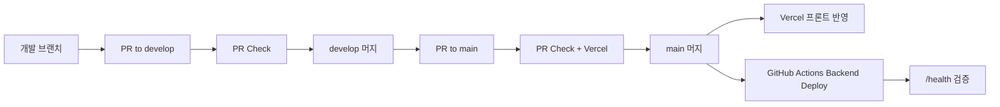

# CI/CD 및 브랜치 보호 런북

## 목적

이 문서는 MBR의 현재 CI/CD 구조와 브랜치 보호 규칙을 운영 관점에서 한 장으로 정리한다.
개발자가 PR을 올리고, 머지하고, 실제 운영 반영 상태를 확인할 때 가장 먼저 보는 문서다.

기준:

- 기준 브랜치: `main`
- 확인 시점: `2026-06-11`

## 현재 운영 흐름



## CI/CD를 MBR 기준으로 보면

- CI
  - PR 단계에서 자동으로 테스트와 빌드를 돌려서 머지 가능 상태를 검증하는 단계
  - MBR에서는 GitHub Actions `PR Check`가 이 역할을 한다
- CD
  - 머지된 결과를 실제 배포 환경에 자동 반영하는 단계
  - MBR에서는 Vercel 프론트 자동 배포와 Fly 백엔드 자동 배포가 이 역할을 한다

## 브랜치 역할

- `feat/fix/refactor` 성격의 작업 브랜치
  - 실제 작업 브랜치
- `develop`
  - 통합 검증 브랜치
- `main`
  - 공개 배포 기준 브랜치

현재 운영 원칙:

- 작업은 `main`, `develop`에서 직접 하지 않는다
- 작업 브랜치 -> `develop` PR -> `main` PR 순서로 올린다

## 자동화 구성

### 1. PR Check

- 워크플로우: `.github/workflows/pr-check.yml`
- 트리거:
  - PR 대상이 `develop`
  - PR 대상이 `main`
- 실행 항목:
  - `Backend Tests`
  - `Frontend Build`
  - `Vercel`

의미:

- 백엔드 테스트와 프론트 빌드가 깨진 상태로 머지되지 않도록 막는다
- `main` PR에서는 Vercel 배포 체크까지 같이 본다

### 2. Frontend Deploy

- 배포 주체: Vercel
- 반영 기준: `main`

의미:

- `main`에 머지되면 프론트는 자동 반영된다
- 별도 수동 배포 명령을 기본 절차로 사용하지 않는다

### 3. Backend Deploy

- 워크플로우: `.github/workflows/backend-deploy.yml`
- 트리거:
  - `main` push
  - 변경 경로가 `backend/**`
  - 또는 workflow 파일 자체 변경

실행 순서:

1. GitHub Actions 실행
2. `flyctl deploy --remote-only --config fly.toml`
3. `https://my-baseball-record.fly.dev/health` 호출
4. `{"status":"ok"}` 응답 확인

의미:

- 백엔드는 `main` 머지 후 자동 배포된다
- health check까지 성공해야 정상 반영으로 판단한다

## 브랜치 보호 규칙

보호 대상:

- `develop`
- `main`

필수 체크:

- `Backend Tests`
- `Frontend Build`
- `Vercel`

추가 정책:

- strict status checks 사용
- 관리자 포함 적용
- force push 금지
- branch deletion 금지
- conversation resolution 필요

## 운영자가 보는 확인 포인트

### develop 머지 전

- PR checks 3개가 모두 통과했는지 확인
- 변경 범위가 문서/프론트/백엔드 중 어디인지 확인

### main 머지 전

- `develop -> main` PR 기준으로 다시 체크 통과 확인
- Vercel preview가 정상인지 확인

### main 머지 후

- 프론트:
  - Vercel production 배포 성공 확인
- 백엔드:
  - GitHub Actions `Backend Deploy` 성공 확인
  - Fly 상태 확인
  - `/health` 응답 확인

## 자주 쓰는 확인 명령

### GitHub Actions 상태 확인

```bash
gh run list --workflow "Backend Deploy"
gh run list --workflow "PR Check"
```

### 특정 PR 체크 확인

```bash
gh pr checks <PR_NUMBER>
```

### Fly 상태 확인

```bash
cd backend
fly status --app my-baseball-record
```

### health 확인

```bash
curl https://my-baseball-record.fly.dev/health
curl https://api.mybaseball.cloud/health
```

## 수동 개입이 필요한 경우

다음 경우에는 수동 확인이나 수동 배포가 필요할 수 있다.

- Fly workflow는 성공했지만 실제 앱 응답이 이상한 경우
- 환경변수 또는 secret 변경이 포함된 경우
- GitHub Actions 장애
- Vercel 배포는 성공했지만 도메인 반영이 늦는 경우

원칙:

- 정상 경로는 항상 자동화 우선
- 수동 배포는 예외 대응으로만 사용

## 현재 남아 있는 운영 과제

- [ ] Fly deploy 성공 후 `api.mybaseball.cloud/health`까지 같은 workflow에서 직접 검증할지 결정
- [ ] 운영용 장애 대응 체크리스트를 별도 문서로 분리할지 결정
- [ ] 백엔드 배포 실패 시 알림 채널을 붙일지 결정
- [ ] DB migration 적용 절차를 런북에 더 구체화할지 결정
